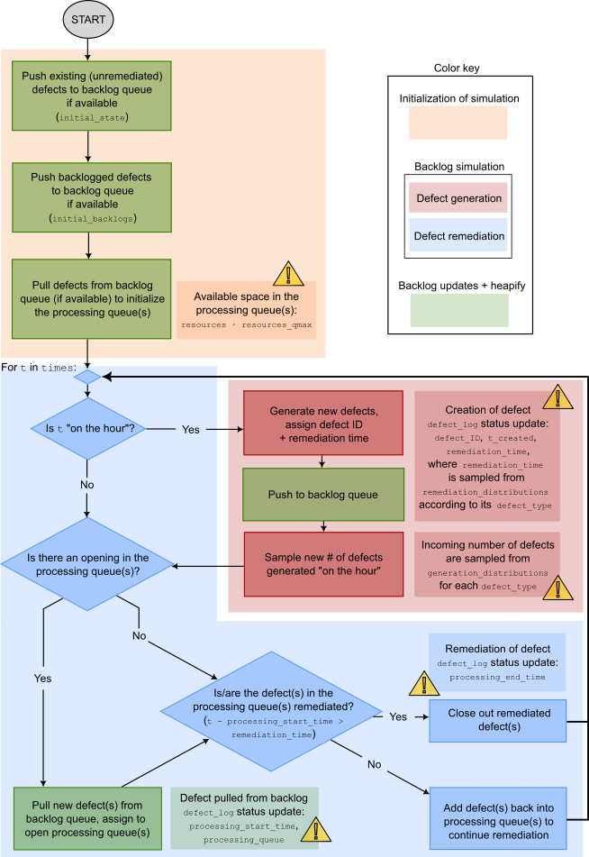

## Modeling remediation of defects as an AI-enhanced queueing optimization problem
In industrial contexts, defect remediation is the process by which defects, or undesirable conditions or events that require specific treatement to be resolved, are corrected. This work introduces a new line of research focusing on
the characterization of the defect remediation process as an AI-enhanced black box generalized Monte Carlo optimization problem.

This work represents a research project in three parts:
#### `queueing-MC` Timeline estimations with a black box generalized Monte Carlo method for modeling defect remediation as a queueing optimization problem
In this problem, we are concerned with building an optimized plan for remediation of defects. We consider that defects are both *incoming* (being generated) and *outgoing* (being remediated) in parallel, although the events occur at non-consistent intervals throughout the simulation. Individual circumstances such as any existing backlogged defects, the priority ranking of defects, and resource and time constraints, are also considered.

**Problem set-up**

The problem is divided into two stages, an initialization stage (orange-shaded regions in Figs. 1 and 2) and a simulation stage. In the former, we are concerned with setting up the backlog and processing queues based on the initial conditions prior to the start of the simulation. The simulation stage is governed by the `times` vector, with defect *generation* (red-shaded regions in Figs. 1 and 2) and defect *remediation* events (blue-shaded regions in Figs. 1 and 2) occuring at any point in time *t*.

**Simulation input parameters**

System-specific input parameters are used to instantiate the simulation (see Fig. 2). They include:

- `--defect_labels`: the defect types to simulate
- `--defect_priority`: the priority level associated with each defect type (lower = higher priority)
- `--maxValue_generation` and `--skewness_generation`: the maximum value (positive integer or 0) and skewness coefficient (float) parameters governing the stochastic distributions for incoming defects (1 pair per defect type)
- `--maxValue_remediation` and `--skewness_remediation`: the maximum value (positive float or 0) and skewness coefficient (float) parameters governing the stochastic distributions for remediation time per defect (1 pair per defect type)
- `--initial_backlogs`: the number of existing defects per defect type prior to the start of the simulation
- `t_end`: the duration of the simulation (or continuation, if `--check_initial_state` is `True`, see below). It should be noted that the time denomination can be anything (seconds, minutes, hours, days, etc). In our version, we consider time *t* to represent hours
- `--resources`: the number of available remediation agents, represented in the simulation as threaded processing queues
- `--resources_qmax`: the maximum number of defects that can be assigned to each processing queue

Simulation-specific input parameters refer to the simulation currently being realized. They include `--trials`, defining the number of times the same simulation is run to account for stochastic differences between simulations, and parameters for loading and/or storing simulation states:

- `--check_initial_state` and `--path_initial_state`: if `--check_initial_state` is `True`, the state of an existing simulation stored as a pickled JSON file at `--path_initial_state` is loaded as the starting point for the current simulation
- `--export_final_state` and `--path_final_state`: if `--export_final_state` is `True`, the final state of the current simulation is exported as a pickled JSON file to `--path_final_state`

**Interpreting the results**

The main results are collected into the dictionary `comparison_dict`, which contains the results of each of the `trials` simulations.

The primary results can be accessed via the master `defect_log`, which will have recorded the lifetime of all defects from generation to remediation by updating the status of each defect at defining moments as shown in Fig. 1.

- [ ] Read our abridged article on Medium [here](https://medium.com/@mdebeurr/modeling-remediation-of-defects-in-industry-as-an-ai-enhanced-queueing-optimization-problem-a389f51d784d)
- [ ] *Stay tuned!* Full scientific article on arXiv

#### `queueless-MC` Timeline and state change estimations with a queueless black box generalized Monte Carlo method based on empirical data
#### *Stay tuned!* Optimizing defect remediation planification with generative AI

### Acknowledgments
This project is sponsored by [Radiant Logic](https://www.radiantlogic.com/), an industry leader in the field of identity and access management (IAM), a sub-field of cybersecurity. 

The field of IAM is concerned with the governance and 
management of user accounts and accesses to applications, platforms and other technology resources with the goal of limiting superfluous or unused accesses that serve as openings for cybersecurity attacks in our increasingly connected 
world. In this context, the *defects* of this work are representative of undesirable, risky or anomalous events that must be reviewed and treated by dedicated remediation actors.