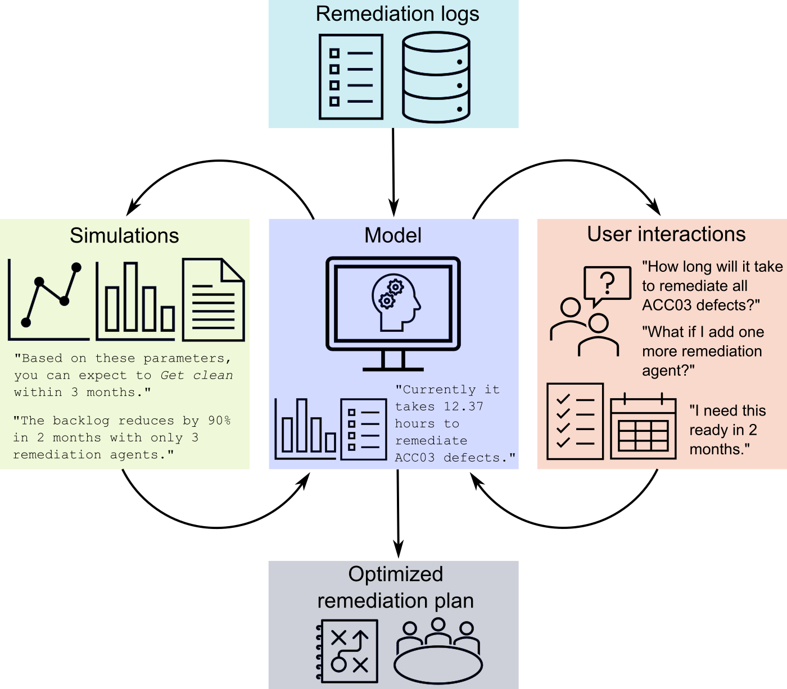

## Modeling remediation of defects as an AI-enhanced queueing optimization problem

### News 📰
- [ ] *18 June 2025* Part 1 of our 3-part series on AI-enhanced defect remediation optimization is available on Medium, read it [here](https://medium.com/@mdebeurr/modeling-remediation-of-defects-in-industry-as-an-ai-enhanced-queueing-optimization-problem-a389f51d784d)
- [ ] *Stay tuned!* Part 2 coming soon
- [ ] *Stay tuned!* Part 3 coming soon
- [ ] *Stay tuned!* Full scientific article on arXiv

### Introduction and background
In industrial contexts, defect remediation is the process by which defects, or undesirable conditions or events that require specific treatement to be resolved, are corrected. This work introduces a new line of research focusing on
the characterization of the defect remediation process as an AI-enhanced black box generalized Monte Carlo optimization problem.

This work represents a research project in three parts:
- `queueing-MC`: forecasting defect remediation with a black box generalized Monte Carlo queueing model
- `queueless-MC`: instantiating the generalized Monte Carlo simulations with historical empirical log data
- `defect_remediation_app`: AI-enhanced defect remediation planification with [`fastWorkflow`](https://github.com/radiantlogicinc/fastworkflow)

The ultimate goal of this research is to develop an agentic AI system for optimization of the defect remediation process as shown in Fig. 1. 

  

Based purely on natural language interactions with the user, the AI agent would be capable of:
- answering questions on current and historical remediation trends,
- setting up and executing remediation forecasts, iterating if necessary to optimize the defect remediation process, and
- answering questions on trends forecasted in the remediation predictions,

with the output of the interaction being an optimized remediation plan relevant to the user and customized to their needs and goals.

### Acknowledgments

The model is developed with a focus on identity and access management (IAM), a sub-field of cybersecurity, where defects represent situations of heightened vulnerability that violate standard cybersecurity good practices.

This project is sponsored by [Radiant Logic](https://www.radiantlogic.com/), an industry leader in the field of identity and access management (IAM), a sub-field of cybersecurity. 

The field of IAM is concerned with the governance and 
management of user accounts and accesses to applications, platforms and other technology resources with the goal of limiting superfluous or unused accesses that serve as openings for cybersecurity attacks in our increasingly connected 
world. In this context, the *defects* of this work are representative of undesirable, risky or anomalous events that must be reviewed and treated by dedicated remediation actors.