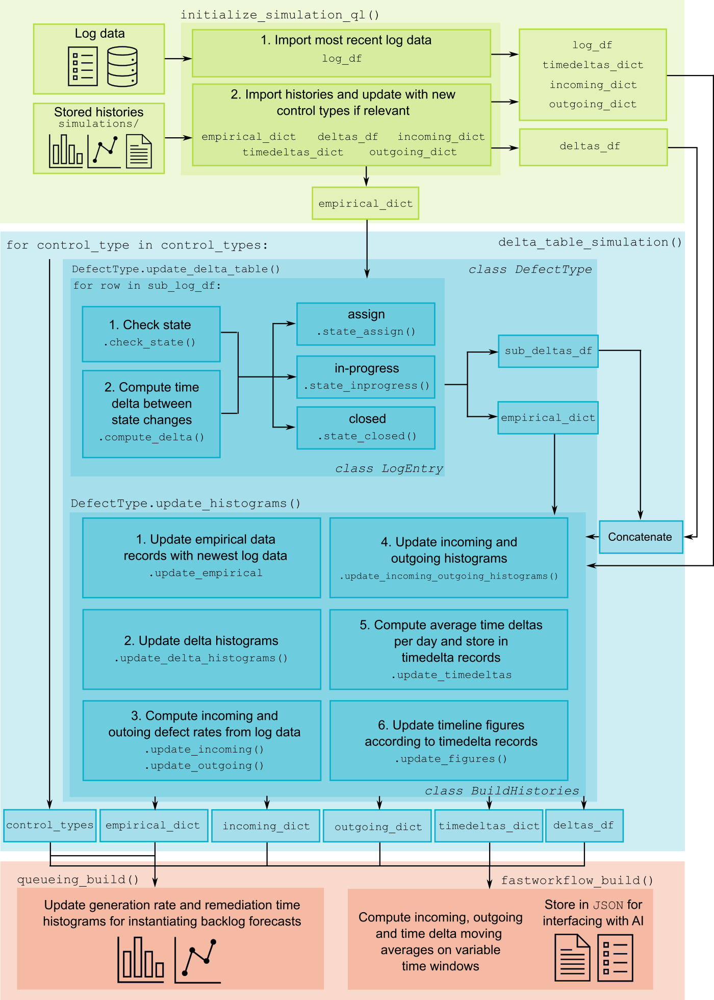
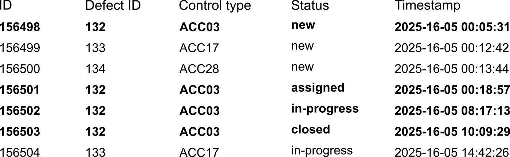
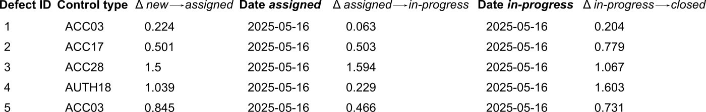

## Part 2 | Modeling remediation of defects in industry as an AI-enhanced queueing optimization problem: Building histories from log data
This work introduces **Part 2** of a new line of research focusing on
the characterization of the defect remediation process as an AI-enhanced black box generalized Monte Carlo optimization problem.

*Coming soon!* Part 2 of our series on AI-enhanced defect remediation optimization on Medium. Read Part 1 [here](https://medium.com/@mdebeurr/modeling-remediation-of-defects-in-industry-as-an-ai-enhanced-queueing-optimization-problem-a389f51d784d).

<!-- Read part 1 of our series on AI-enhanced defect remediation optimization on Medium [here](https://medium.com/@mdebeurr/modeling-remediation-of-defects-in-industry-as-an-ai-enhanced-queueing-optimization-problem-a389f51d784d). -->

This work represents a research project in three parts:
- Part 1 | `queueing-MC`: forecasting defect remediation with a black box generalized Monte Carlo queueing model
- Part 2 | `queueless-MC`: instantiating the generalized Monte Carlo simulations with historical empirical log data
- Part 3 | `defect_remediation_app`: AI-enhanced defect remediation planification with [`fastWorkflow`](https://github.com/radiantlogicinc/fastworkflow)

## Introduction and background

   Figure 1: System diagram for the empirical model and the classes DefectType, LogEntry and Build Histories. The initialization, Delta table simulation, and configuration stages are shaded in green, blue and orange, respectively.

In industrial contexts, defect remediation is the process by which defects, or undesirable conditions or events that require specific treatement to be resolved, are corrected. In [Part 1](https://github.com/radiantlogicinc/estimating_gen_mc_simulation/tree/main/queueing-MC), we introduced a queueing model for forecasting and optimizing the defect remediation process. In this work, we show how the model can be enhanced and customized to an organization's own historical data, and set the stage for introducing agentic AI to accelerate defect remediation optimization.

## Problem description

In this problem, we seek to build a statistical model for the defect lifecycle based on empirical log data in order to better inform predictions of the defect remediation process. In the queueing optimization problem of [Part 1](https://github.com/radiantlogicinc/estimating_gen_mc_simulation/tree/main/queueing-MC), the defect generation and remediation time histograms were defined as input parameters to the simulation as normalized skew-normal distributions. As a next step in the model, we seek to establish these distributions from empirical data, i.e. compute the incoming rate and remediation times of defects directly from historical log data tracking the status changes throughout the defects' lifetimes.

The longer the historical log data is tracked, the more reflective the histograms become of any real-life trends hidden within it, and the more likely the forecasted simulations based on these histograms will match reality.

### Format of historical log data

   Table 1: Example remediation log tracking the status changes of each defect throughout its lifecycle. Bolded rows indicate the full lifecycle of a single defect (Defect ID 132).

The heart of the empirical model lies in the availability of historical remediation log data. 

During remediation, we consider that all defects follow a lifecycle process that can be modeled as a series of state or status changes in the pattern `new` → `assigned` → `in-progress` → `closed`, where: 
- `new` indicates when a defect is first detected,
- `assigned` indicates that a defect has been assigned to a remediation agent,
- `in-progress` indicates that the assigned remediation agent has begun remediation work on the defect, and
- `closed` indicates that the defect has been remediated and closed out.

We consider that as defect remediation is being carried out, the status changes of each defect are tracked in the form of historical remediation logs (Table 1), where each row in the log corresponds to a state change and the timestamp at which the change occurred, across all defects.

### Empirical model

The empirical model as shown in Fig. 1 is built around a three-stage progression: an initialization stage, a Delta table computation stage and a configuration stage, where the updated historical data is configured in `JSON` files for integration with the forecasting model of [Part 1](https://github.com/radiantlogicinc/estimating_gen_mc_simulation/tree/main/queueing-MC) and future agentic AI.

In the initialization stage, the log data to process and any stored histories (from already-processed log data) are imported into the model. The imported log data is used to compute the time deltas between each state change of the defect lifecycle for each defect in the log data: Δ `new` → `assigned`, Δ `assigned` → `in-progress`, Δ `in-progress` → `closed`, Δ `new` → `closed` - these measured time deltas are collected into the so-called Delta table. The values contained in the Delta table are then appended to the stored histories, from which updated versions of the aforementioned `JSON` integration files are extracted.

### Simulation input and output parameters
**Input parameters**

To build the empirical model, only the path to the log data is needed as an input parameter:
- `--path_logs`: the path to the log data, stored as a `JSON` or `CSV` file

**Output parameters: storing the historical data**

The historical outputs of the empirical model are stored and updated as `JSON` files in the `simulations` folder whenever new log data is processed.

### Interpreting the results

Three important elements are updated each time the empirical model is run.

#### Delta table and timeline figures ####

   Table 2: First rows of the Delta table computed from the remediation log located here. Note that the columns Δ new → closed and Date closed have been omitted to save space.

The Delta table (Table 2) is updated for each control type each time log data is processed.

Using the information in the Delta table, the evolution of the time deltas per defect type can also be tracked, represented graphically as timeline figures. These timeline figures are useful in uncovering patterns (improvements, regressions and anomalies) in the defect remediation process, and furthermore provide a basis for measuring performance according to a sliding window. Averages across the past day, week, month, year, etc., are readily computed from the timeline histories, and anomalous or undesirable events can be highlighted or filtered out according to the sliding window across which the averages are calculated.

#### Generation and remediation histograms with `queueing_build`

The generation and remediation histograms used to build defect backlog forecasts are also updated. The generation histograms are built up for each defect type based on the rates of incoming defects in the log data. The remediation histograms governing total remediation time per defect are likewise built up from the Δ `new` → `closed` values stored in the Delta table.

In the model, the generation and remediation histograms are updated through a function called `queueing_build` (orange-shaded region in Fig. 1).

#### Setting up for agentic behavior with `fastworkflow_build` ####

The final element produced by the empirical model is a setup for integration with generative AI and future agentic behavior with the technology [`fastWorkflow`](https://github.com/radiantlogicinc/fastworkflow). In a process similar to `queueing_build`, the function `fastworkflow_build` (orange-shaded region in Fig. 1) compiles data into a `JSON` file structured for future interaction with an AI agent. In particular, the sliding-window averages mentioned above are computed for the time deltas between state changes as well as for the generated and remediated defects.

*Coming soon!* Part 3 of this project introduces the method for integrating the empirical model (Part 2) and remediation forecasts (Part 1) with a `fastWorkflow`-enabled AI agent for accelerating defect remediation planification and optimization.

## Acknowledgments

This project is sponsored by [Radiant Logic](https://www.radiantlogic.com/), an industry leader in the field of identity and access management (IAM), a sub-field of cybersecurity. 

The field of IAM is concerned with the governance and 
management of user accounts and accesses to applications, platforms and other technology resources with the goal of limiting superfluous or unused accesses that serve as openings for cybersecurity attacks in our increasingly connected 
world. In this context, the defects of the model are representative of situations of heightened vulnerability that violate standard cybersecurity good practices.